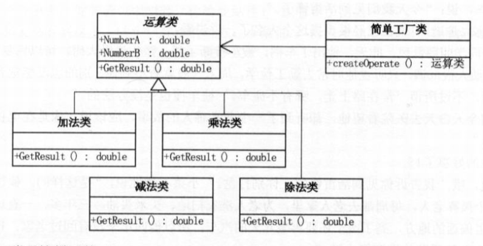
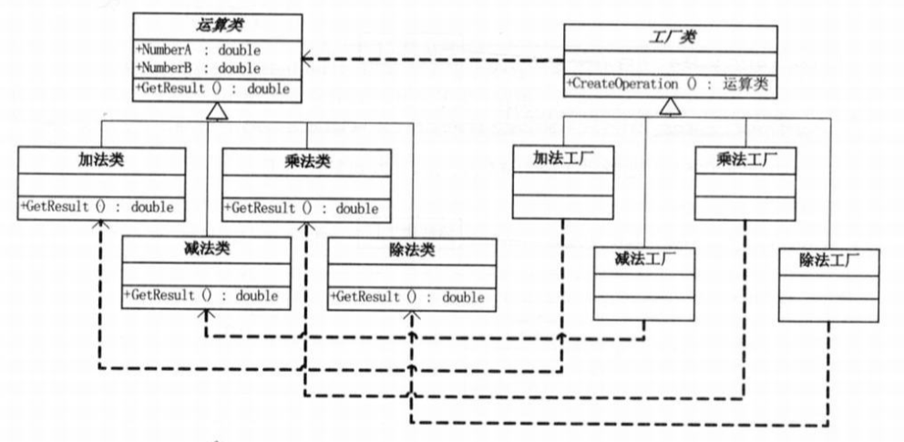
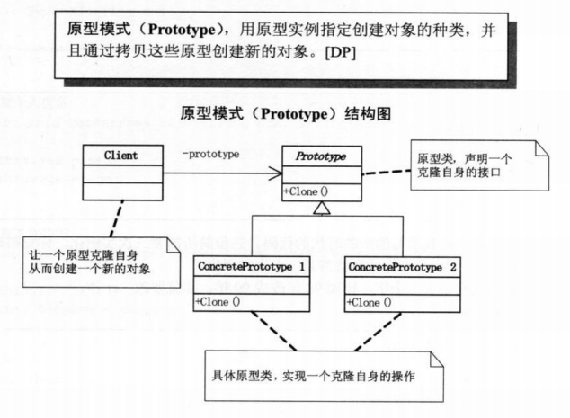
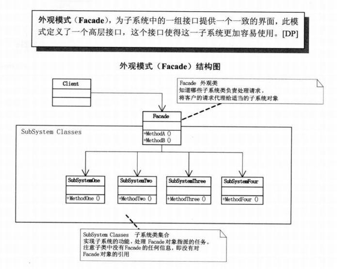
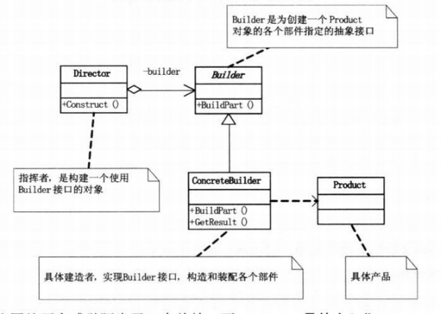

当朝大学士，总共有3位，朕不得不罢免4位 
别看你们一个个站在干岸上，设计模式你们还记得多少吗--  
<!-- more -->

# 设计原则
## 单一职责原则|SRP
就一个类而言，应该仅有一个引起它变化的原因  
如果一个类承担的之策过多，等于将这些职责耦合再一起，
单个职责变化会削弱或抑制这个类完成其他职责的能力。
该种耦合会导致设计脆弱，甚至产生意外破坏(ASD);  

## 开放-封闭原则
对扩展开放(Open for extension)    
对更改封闭(Closed for modification)  
要对频繁变化的模块进行抽象，但全部抽象也不好  

## 依赖倒转原则
强内聚，松耦合  
抽象不应依赖细节，细节应依赖于抽象  
针对接口编程，不要对实现编程
A.高层模块不应该依赖低层模块，两个都应该依赖抽象  
B.抽象不应该依赖细节。细节应该依赖抽象。

## 迪米特法则(最少知识原则)[LoD]
如果两个类不必彼此直接通信，那么这两个类不该发生直接相互作用。
如果一个类需要调用另一个类的某个方法，可通过第三者转发这个调用。[J&DP]
### 体现
每个类应当尽量降低成员的访问权限。  
强调类之间的松耦合，类与类之间耦合越弱，越有利于复用。单个弱耦合的类被修改，不会波及现有的关系类。


里氏代换原则  —>  
一个软件实体如果使用的是一个父类，那么一定适用于其子类，而软件无法察觉其变化。  
里氏代换原则(LSP)：子类型必须能够替换掉它们的父类型[ASD]。  
由于子类型的可替换性才使得父类的模块再无需修改时就可扩展。  

依赖倒转是面向对象设计的标志，如果编写时考虑的是如何针对抽象编程而不是针对编程细节，
即程序中的依赖关系都是终于抽象类和接口，那就是面向对象设计，反之为过程化的设计。  


## 面向对象

### 活字印刷
例子++

1.可维护；【只改需改之字】  
2.可复用；  
3.可扩展；【可加字】  
4.灵活性；【横排换竖排】  

### 好处
通过封装、继承、多态将程序的耦合性降低  
设计模式使得其更加灵活，容易修改且易于复用  

### 业务封装
火星车程序的分离  
将客户端和服务端分离  

题目：  
一队机器人漫游车将被美国宇航局降落在火星高原上。
漫游车将在这个奇怪的长方形高原上巡游，
以便他们的机载摄像头可以获得周围地形的完整视图，并将其发送回地球。
漫游者的坐标和位置由x和y坐标的组合以及代表四个方向（E, S, W, N）的字母表示。
高原划分为网格以简化导航。比如位置0，0，N，表示漫游车位于左下角并面向北。
为了控制漫游车，美国宇航局发送一串简单的字母。
指令字母是'L'，'R'和'M'。 'L'和'R'使漫游车分别向左或向右旋转90度，而不会从当前地点移动。
'M'表示前进一个网格点，并保持相同的方向。
假设从（x，y）直接向北移动，就到了（x，y + 1）。

INPUT：  
第一行输入是平台的右上角坐标，左下角坐标被假定为0,0。
其余的输入是有关已部署的漫游车的信息。每个漫游车都有两行输入。
第一行给出了漫游车的位置，第二行是告诉漫游车如何探索高原的一系列指令。
位置由两个整数和一个由空格分隔的字母组成，对应于x和y坐标以及漫游车当前的方向。
每个漫游车将按顺序完成，这意味着第二个漫游车在第一个漫游车完成移动之前不会开始移动。

OUTPUT:  
每个漫游车的输出应该是其最终的坐标和位置。
输入输出例子:  
IN:  
5 5  
1 2 N  
LMLMLMLMM  
3 3 E  
MMRMMRMRRM  

OUT：  
1 3 N  
5 1 E  

#### 服务端封装
```
    class Rover constructor(var x:Long, var y:Long, var z:String){
    
        val rangez= arrayListOf("e","s","w","n")
        val rangeZ= arrayListOf("E","S","W","N")
    
        fun numL(z:Int)=if (z==0) 3 else z-1
        fun numR(z:Int)=if (z==3) 0 else z+1
    
        fun doL(){
            val i1=rangeZ.indexOf(z)
            val i2=rangez.indexOf(z)
            val i= intArrayOf(i1,i2).max()
            val ii=numL(i!!)
            z=rangeZ[ii]
        }
    
        fun doR(){
            val i1=rangeZ.indexOf(z)
            val i2=rangez.indexOf(z)
            val i= intArrayOf(i1,i2).max()
            val ii=numR(i!!)
            z=rangeZ[ii]
        }
    
        fun doM(){
            when(z){
                "E" ->  x++
                "S" ->  y--
                "W" ->  x--
                "N" ->  y++
            }
        }
    }
```
#### 操作界面封装
```
    val Rovers= MutableList(0,{ Rover(1, 1, "N") })
    val sc = Scanner(System.`in`)
    
    var boderX=0L
    var boderY=0L
    val rangeZ= arrayListOf("E","S","W","N")
    
    fun InputSize(){
        println("please input map size:'x y'")
        val mapSize = sc.nextLine()
        WashSize(mapSize)
    }
    fun RoverSet(){
        InputLocation()
        InputCommand()
    }
    fun InputLocation(){
        println("please input io.hongxi.simpleFactory.encapsulation.Rover's location:'x y z',example:'1 1 N','2 2 W'..  z in ['E','S','W','N']")
        val location = sc.nextLine()
        WashLocation(location)
    }
    fun InputCommand(){
        println("please input command,example:'LMLMLMLMM'..  char in ['L','R','M']")
        val command = sc.nextLine()
        for (cmd in command)
            when(cmd){
                'l' -> Rovers.last().doL()
                'L' -> Rovers.last().doL()
                'r' -> Rovers.last().doR()
                'R' -> Rovers.last().doR()
                'm' -> Rovers.last().doM()
                'M' -> Rovers.last().doM()
            }
    
        println("enter to add rovers more,else input 'end' to end")
        val cmd = sc.nextLine()
        if (cmd=="END"|| cmd=="end"){
            doResult()
            return
        }else
            RoverSet()
    }
    
    fun WashSize(mapSize:String){
    
        val list=mapSize.split(' ').toMutableList()
        list.removeAll(Array(99,{""}))
    
        if (list.size!=2){
            System.err.println("wrong input,please input again:'x y'")
            InputSize()
            return
        }
        try {
            boderX =list[0].toLong()
            boderY =list[1].toLong()
        } catch (e:Exception){
            System.err.println("wrong input,please input again:'x y'")
            InputSize()
            return
        }
        if (boderX <1 || boderY <1){
            System.err.println("wrong input,please input again:'x y'")
            InputSize()
            return
        }
    
        println("mapSize=$list")
        RoverSet()
    }
    fun WashLocation(location:String){
        val list=location.split(' ').toMutableList()
        list.removeAll(Array(99,{""}))
    
        val x:Long
        val y:Long
        val z:String
        if (list.size!=3){
            System.err.println("wrong input,please input again:'x y z',example:'1 1 N','2 2 W'..  z in ['E','S','W','N']")
            InputLocation()
            return
        }
        try {
            x=list[0].toLong()
            y=list[1].toLong()
            z=list[2]
        } catch (e:Exception){
            System.err.println("wrong input,please input again:'x y z',example:'1 1 N','2 2 W'..  z in ['E','S','W','N']")
            InputLocation()
            return
        }
        if (x !in 0..boderX || y !in 0..boderY || z !in rangeZ){
            System.err.println("wrong input,please make x in 0..$boderX, y in 0..$boderY and z in ['E','S','W','N']")
            InputLocation()
            return
        }
    
        Rovers.add(Rover(x, y, z))
    }
    
    fun doResult(){
        for (rover in Rovers)
            println("${rover.x} ${rover.y} ${rover.z}")
    }
    
    
    fun main(args: Array<String>) {
        InputSize()
        /**
        Input
        5 5
        1 2 N
        LMLMLMLMM
        3 3 E
        MMRMMRMRRM
        OutPut：
        1 3 N
        5 1 E*/
    } 
```


# 简单工厂模式|Simple factory


## 简单工厂模式封装
```
    interface Do{
    
        var x:Int
        var y:Int
        var z:Char
    
        fun numL(z:Int):Int
        fun numR(z:Int):Int
    
        val rangeZ:List<Char>
        fun DoResult(): Rover
    }
    
    data class DoL(override var x:Int,
                    override var y:Int,
                    override var z:Char) :Do{
    
        override fun numL(z:Int)=if (z==0) 3 else z-1
        override fun numR(z:Int)=if (z==3) 0 else z+1
    
        override val rangeZ=arrayListOf('E','S','W','N')
        override fun DoResult(): Rover {
    
            val i=rangeZ.indexOf(z)
            val ii=numL(i)
            z=rangeZ[ii]
            return Rover(x,y,z)
        }
    }
    
    data class DoM(override var x:Int,
              override var y:Int,
              override var z:Char) :Do{
    
        override fun numL(z:Int)=if (z==0) 3 else z-1
        override fun numR(z:Int)=if (z==3) 0 else z+1
    
        override val rangeZ=arrayListOf('E','S','W','N')
    
        override fun DoResult(): Rover {
            when(z){
                'E' ->  x++
                'S' ->  y--
                'W' ->  x--
                'N' ->  y++
            }
            return Rover(x,y,z)
        }
    }
    
    class DoR(override var x:Int,
              override var y:Int,
              override var z:Char) :Do{
    
        override fun numL(z:Int)=if (z==0) 3 else z-1
        override fun numR(z:Int)=if (z==3) 0 else z+1
    
        override val rangeZ=arrayListOf('E','S','W','N')
    
        override fun DoResult(): Rover {
    
            val i=rangeZ.indexOf(z)
            val ii=numR(i)
            z=rangeZ[ii]
            return Rover(x,y,z)
        }
    }
```

## 松紧耦合
紧耦合：  
Rover对象的L,R,M方法写在一起，需求改变时需要需直接改变方法  
松耦合：  
解耦函数架构，将每个方法抽象成功能类

## UML类图
分三层  
1.类名(抽象类用斜体)  
2.字段属性  
3.方法行为  


# 策略模式|Strategy Mode
商场收银系统   
## 简单工厂实现
现金收费对象下有多个实现子类
```
    class 收费对象{
        fun 收费(money:Money)=money
    }
    
    class 正常收费：收费对象{
        override fun 收费(money:Money)=money
    }
    
    class 折扣收费(折扣倍率：折扣)：收费对象{
        override fun 收费(money:Money)=money*折扣倍率
    }
    
    class 返利收费(返利条件，返利值)：收费对象{
        override fun 收费(money:Money){
            if(返利条件) money-=返利值
            return money
        }
    }
    
    Object  收费工厂{
        
        fun 收费对象生成(type):收费对象{
            
            when(type){
                "正常收费"  -> return 正常收费()
                "折扣收费"  -> return 折扣收费(折扣倍率)
                "返利收费"  -> return 返利收费(返利条件，返利值)
            }
        }
    }
```
## 策略模式
定义了算法家族，将其分别封装，之间可相互替换，不影响算法使用者  
将上面的收费对象定义为接口即可，在需要的时候继承再new生成创建对象实例  
策略者模式将所有算法封装在接口中，调用时取用其子类生成的实例  

## 说明
优点：  
策略类层配合Const常量定义了可重用的方法，助于析取公共方法  
简化单元测试


# 装饰模式|Decoration mode
动态的给一个对象添加一些额外的职责  
//比生成子类更灵活  

通过继承原始类，覆写部分功能来实现

Component类
```
    abstract class ComPonent{
        public abstract void Operation();
    }
```
ConcreteComponent 类
```
    class ConcreteComponent:Component{
        public override void Operation(){
            Console.WriteLine("具体操作")
        }
    }
```
Decorator 类
```
    abstract class Decorator:Component{
        
        protected Compenent component;
        public void SetComponent(Compenent component){
            this.component=component;
        }
        public override void Operation(){
            if(component!=null)
            component.Operation();//实际执行我们放入的component的operation
        }
    }
```

ConcreteDecoratorA-装饰实体类
```
    class ConcreteSecoratorA:Decorator{
        
        private String addedState;          //该类独有功能，不同于ConcreteSecoratorB
        public override void Operation(){
            base.Operation();               //先执行原component的operation,再执行本类的功能
            addedState= "new star";
            Console.WriteLine("装饰对象A操作");
        }
    }
```

## 说明
装饰模式是为已有功能动态添加更多功能的方式。  
每个装饰的功能再单独的类中，并包装了他所装饰的对象，可自由处理。


# 代理模式 | proxy
代理接口
```
    intface GiveGift{
        fun GiveDolls()
        fun GiveFlowers()
        fun GiveChocolate()
    }
```

追求者类
```
    class Pursuit(val girls: Girl):GiveGift { 
        override fun GiveDolls() = println("${girls.name}  送你洋娃娃")
        override fun GiveFlowers()= println("${girls.name}  送你洋鲜花")
        override fun GiveChocolate() = println("${girls.name}  送你巧克力")
    }
```

代理类
```
    class Proxy(girl: Girl):GiveGift {
        val gg=Pursuit(girl)
        override fun GiveDolls()=gg.GiveDolls()
        override fun GiveFlowers() =gg.GiveFlowers()
        override fun GiveChocolate()=gg.GiveChocolate()
    }
```

实现
```
    class Proxy(girl: Girl):GiveGift {
        val gg=Pursuit(girl)
        override fun GiveDolls()=gg.GiveDolls()
        override fun GiveFlowers() =gg.GiveFlowers()
        override fun GiveChocolate()=gg.GiveChocolate()
    }
```
阿珍不认识追她的人，但是通过代理拿到了礼物

## 说明
代理模式为其他对象提供了一种代理以控制这个对象的访问

## 应用
1.远程代理：为一个对象再不同地址空间提供局部代表。
同时隐藏一个对象存在不同地址空间的事实。  
2.虚拟代理：按需创建大开销对象，来预缓存真实对象。(如预加载缓存框)  
3.安全代理：控制真实对象访问时权限。
4.智能指引：调用当前实例对象时，同时代理处理一些别的事。


# 工厂方法 | Factory Method
## 简单工厂VS工厂方法
简单工厂下的计算器实现


工厂方法下的计算器实现


简单工厂的优点在于工厂类中包含了必要的判断逻辑，由客户端的条件去选择动态实例化。  
例如计算器，如果只有‘+’，将‘+’给具体工厂，工厂会很快给出实例。  
但是如果"求M数的N次方"功能，那么在运算工厂里需要加入case分支，违背了开放-封闭原则。  
所以才有了工厂方法模式。  
工厂方法克服了简单工厂违反开放-封闭原则的特点，又保持了封装对象创建过程的优点。  
但是每加一个产品，就要加一个产品工厂的类，有额外的开发量增加。  


# 原型模式 | Prototype
用原型实例指定创建对象的种类，并通过拷贝这些原型创建新的对象。  
其实就是从一个对象再创建另外一个可定制的对象，且不需知道创建细节。  


## 深浅复制
.Clone()方法会复制对象DataSet解构但不复制数据。(对象中的对象引用还是引用)  
.Copy() 不止复制结构，也复制数据。  
//kotlin中的clone需要原类型继承kotlin.Cloneable  
```
    class Example : Cloneable {
        override fun clone(): Any { ... }
    }
```


# 模板方法
## Example-试卷复用与答案返回
```
    calss TestPaper{
        
        fun TestQuestion1(){
            plint("第1题题干 选项：A,B,C,D")
            plint("答案=${::Answer()}")   //Answer来自以下方法
        }
        ...
        
        protected fun Answer1()="C"
        ...
    }
```
## 说明
 模板方法模式：定义一个操作中算法的骨架，将一些步骤延迟到子类中。  
 模板方法使得子类可以不改变一个算法的结构即可重定义算法的某些特征步骤
## 原型
原始类
```
    class AbstractClass{
        fun PrimitiveOperation1()
        fun PrimitiveOperation2()
        
        fun TemplateMethond(){      //模板方法-逻辑骨架，具体由子类去实现
            PrimitiveOperation1()
            PrimitiveOperation2()
            plint("done")
        }
    }
```
实现类
```
    class ConcreteClassA:AbstractClass{
        
        override fun PrimitiveOperation1(){
            ...
        }
        override fun PrimitiveOperation2(){
            ...
        }
                
        override fun TemplateMethond(){
            PrimitiveOperation1()
            PrimitiveOperation2()
            plint("done")
        }
    }
```

## 总结
模板方法通过把不变行为搬移到超类，去除子类重复代码。  
提供很好的代码复用平台。  
当不变行为和可变行为再方法子类实现中混合在一起，不变行为会在子类中重复出现。
模板方法可以将这些行为搬移到单一的地方，帮助子类摆脱重复不变形为的纠缠。


# 外观模式 | Facade
为系统中一组接口提供一个一致的界面，此模式定义了一个高层接口，使得子系统增加易用。  

## Example
子系统类
```
    class SubSystem1{
        fun Method1()=print("子系统方法1")
    }
    class SubSystem2{
        fun Method2()=print("子系统方法2")
    }
    class SubSystem3{
        fun Method3()=print("子系统方法3")
    }
    class SubSystem4{
        fun Method4()=print("子系统方法4")
    }
```
外观类
```
    class Facade{
        
        val subSystem1:SubSystem1
        val subSystem2:SubSystem2
        val subSystem3:SubSystem3
        val subSystem4:SubSystem4
        
        fun MethodA(){
            subSystem1.Method1()
            subSystem2.Method2()
        }
        fun MethodB(){
            subSystem3.Method3()
            subSystem4.Method4()
        }
    
    }
```
## 说明
外观模式，完美体现了依赖倒转原则和迪米特法则思想，是常用的设计模式。  
1.设计初期，有意识的将不同层分离。(在数据访问层，业务逻辑层，表示层)进行外观逻辑包装。  
2.开发阶段，因子系统太复杂可使用外观模式提供简单接口。  
3.维护大型遗留系统，开发新的外观结构类，为老代码提供方便清晰的接口。  


# 建造者模式 | 生成器模式 Builder


## 结构
Product -产品，由多个部件组成
```
    class Product {
        val parts= MutableList<String>(0,{""})
        fun Add(part:String)=parts.add(part)
        fun Show(){
            println("产品创建")
            for (part in parts)
                print(part+" |")
        }
    }
```
Builder - 抽象建造者 确定产品由A和B组成，声明得到产品建造后结果的方法
```
    abstract class Builder {
        abstract fun BuildPartA()
        abstract fun BuildPartB()
        abstract fun GetResult():Product
    }
```
ConcreteBuilder0,1 - 具体建造者类
```
    class ConcreteBuilder0:Builder() {
    
        val product=Product()
        override fun BuildPartA(){
            product.Add("partA")
        }
        override fun BuildPartB() {
            product.Add("partB")
        }
        override fun GetResult()=product
    }
    
    class ConcreteBuilder1:Builder() {
        
        val product=Product()
        override fun BuildPartA(){
            product.Add("partX")
        }
        override fun BuildPartB() {
            product.Add("partY")
        }
        override fun GetResult()=product
    }
```
Director - 指挥者
```
    class Director(builder:Builder) {
        fun Construct(builder:Builder){
            builder.BuildPartA()
            builder.BuildPartB()
        }
    }
```

场景：
```
    fun main(args: Array<String>) {
        
        val builder=ConcreteBuilder0()
        val builder1=ConcreteBuilder1()
        val director=Director(builder)
        
        director.Construct(builder)
        val p0=builder.GetResult()
        p0.Show()
    
        director.Construct(builder1)
        val p1=builder.GetResult()
        p1.Show()
    }
```

## 总结
建造者模式是在  
当  
创建复杂对象的算法  
    应该独立于该对象的组成部分ui它们装配方式时  
    适用的模式


