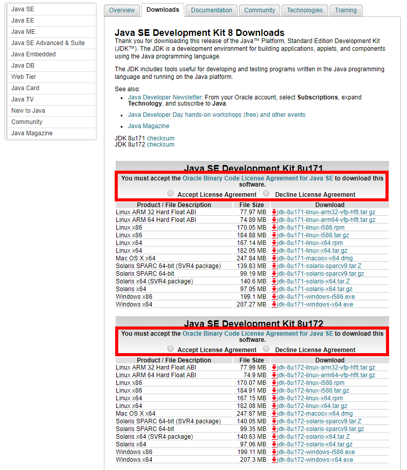

## 说明
本文主要说明在Linux中配置jdk和tomcat,将自己在配置过程中遇到的一些问题及相关的解决方案也列举出来

## Jvm
### Install
#### Go to Download JDK
[Java SE Download Page On Oracle](http://www.oracle.com/technetwork/java/javase/downloads/index.html)    
[Java se 8](http://www.oracle.com/technetwork/java/javase/downloads/jdk8-downloads-2133151.html)  
   
[Jdk 8u172 For Linux.trr.gz](http://download.oracle.com/otn-pub/java/jdk/8u172-b11/a58eab1ec242421181065cdc37240b08/jdk-8u172-linux-x64.tar.gz)

**WARNING**  
Cannot Use Next Code Get tar.gz Package
```
    [root@colinECS download]# wget http://download.oracle.com/otn-pub/java/jdk/8u172-b11/a58eab1ec242421181065cdc37240b08/jdk-8u172-linux-x64.tar.gz
    
    --2018-06-04 09:36:08--  http://download.oracle.com/otn-pub/java/jdk/8u172-b11/a58eab1ec242421181065cdc37240b08/jdk-8u172-linux-x64.tar.gz
    Resolving download.oracle.com (download.oracle.com)... 23.211.96.75
    Connecting to download.oracle.com (download.oracle.com)|23.211.96.75|:80... connected.
    HTTP request sent, awaiting response... 302 Moved Temporarily
    Location: https://edelivery.oracle.com/otn-pub/java/jdk/8u172-b11/a58eab1ec242421181065cdc37240b08/jdk-8u172-linux-x64.tar.gz [following]
    --2018-06-04 09:36:08--  https://edelivery.oracle.com/otn-pub/java/jdk/8u172-b11/a58eab1ec242421181065cdc37240b08/jdk-8u172-linux-x64.tar.gz
    Resolving edelivery.oracle.com (edelivery.oracle.com)... 184.26.250.202, 2600:1417:76:19a::2d3e, 2600:1417:76:181::2d3e
    Connecting to edelivery.oracle.com (edelivery.oracle.com)|184.26.250.202|:443... connected.
    HTTP request sent, awaiting response... 302 Moved Temporarily
    Location: http://download.oracle.com/errors/download-fail-1505220.html [following]
    --2018-06-04 09:36:09--  http://download.oracle.com/errors/download-fail-1505220.html
    Connecting to download.oracle.com (download.oracle.com)|23.211.96.75|:80... connected.
    HTTP request sent, awaiting response... 200 OK
    Length: 5307 (5.2K) [text/html]
    Saving to: ‘jdk-8u172-linux-x64.tar.gz’
    
    100%[======================================>] 5,307       --.-K/s   in 0s
    
    2018-06-04 09:36:09 (492 MB/s) - ‘jdk-8u172-linux-x64.tar.gz’ saved [5307/5307]
```
**WHY**  
If we user command 'tar -xzvf' we will get
```
    [root@colinECS download]# tar -xzvf jdk-8u172-linux-x64.tar.gz
    
    gzip: stdin: not in gzip format
    tar: Child returned status 1
    tar: Error is not recoverable: exiting now
```
Here we can see some error out    
Also we can feel there has something wrong in somewhere  
Where?  
Yes here:  
```
    100%[======================================>] 5,307       --.-K/s   in 0s
    2018-06-04 09:36:09 (492 MB/s) - ‘jdk-8u172-linux-x64.tar.gz’ saved [5307/5307]
```
The package just 5307Kb  
The correct package cannot be so small  
If we go the [Java Home Page](http://www.oracle.com/technetwork/java/javase/downloads/jdk8-downloads-2133151.html)  
We can see if you want download you must Accept a option:  
  

If we just use command 'wget',
we will download the package without accept the license,
So we cannot unpack the package

##### Correct way
We need use browser to accept the license and download the package  
then use Ftp/Sftp tools move the package to your linux server  
Or you can use command rpm to get package  

#### Expand the package 
``` 
    [root@localhost software]# mkdir -p /usr/lib/jvm
    [root@localhost software]# tar -zxvf jdk-8u131-linux-x64.tar.gz -C /usr/lib/jvm
```
#### Set Envionment variables
```
    [root@localhost software]# vim /etc/profile
```
Insert in head this:
```
    export JAVA_HOME=/usr/lib/jvm/jdk1.8.0_131  
    export JRE_HOME=${JAVA_HOME}/jre  
    export CLASSPATH=.:${JAVA_HOME}/lib:${JRE_HOME}/lib  
    export  PATH=${JAVA_HOME}/bin:$PATH
```
#### Make function useful
```
    [root@localhost software]# source /etc/profile
```
#### Check Version
```
    [root@localhost software]# java -version
    
    java version "1.8.0_172"
    Java(TM) SE Runtime Environment (build 1.8.0_172-b11)
    Java HotSpot(TM) 64-Bit Server VM (build 25.172-b11, mixed mode)
```
**Suucess**
<br/>  
<br/>  
<br/>   


### Remove
#### check version
```
    [root@localhost software]# java -version

    openjdk version "1.8.0_102"
    OpenJDK Runtime Environment (build 1.8.0_102-b14)
    OpenJDK 64-Bit Server VM (build 25.102-b14, mixed mode)
```
#### 2. 检测jdk安装包
```
    [root@localhost software]# rpm -qa | grep java

    java-1.7.0-openjdk-1.7.0.111-2.6.7.8.el7.x86_64
    python-javapackages-3.4.1-11.el7.noarch
    tzdata-java-2016g-2.el7.noarch
    javapackages-tools-3.4.1-11.el7.noarch
    java-1.8.0-openjdk-1.8.0.102-4.b14.el7.x86_64
    java-1.8.0-openjdk-headless-1.8.0.102-4.b14.el7.x86_64
    java-1.7.0-openjdk-headless-1.7.0.111-2.6.7.8.el7.x86_64\
```
#### 3. 卸载openjdk
```
    [root@localhost software]# rpm -e --nodeps tzdata-java-2016g-2.el7.noarch
    [root@localhost software]# rpm -e --nodeps java-1.7.0-openjdk-1.7.0.111-2.6.7.8.el7.x86_64
    [root@localhost software]# rpm -e --nodeps java-1.7.0-openjdk-headless-1.7.0.111-2.6.7.8.el7.x86_64
    [root@localhost software]# rpm -e --nodeps java-1.8.0-openjdk-1.8.0.102-4.b14.el7.x86_64
    [root@localhost software]# rpm -e --nodeps java-1.8.0-openjdk-headless-1.8.0.102-4.b14.el7.x86_64
```
或者使用
```
    [root@localhost jvm]# yum remove *openjdk*
```
之后再次输入rpm -qa | grep java 查看卸载情况：
```
    [root@localhost software]# rpm -qa | grep java
    
    python-javapackages-3.4.1-11.el7.noarch
    javapackages-tools-3.4.1-11.el7.noarch
```
<br/>
<br/>
<br/>


### 安装
#### Go to 下载 JDK
[Oracle Java官网](http://www.oracle.com/technetwork/java/javase/downloads/index.html)    
[Java se 8](http://www.oracle.com/technetwork/java/javase/downloads/jdk8-downloads-2133151.html)  
   
[Jdk 8u172 For Linux.trr.gz](http://download.oracle.com/otn-pub/java/jdk/8u172-b11/a58eab1ec242421181065cdc37240b08/jdk-8u172-linux-x64.tar.gz)

**注意**  
不可以用'wget'命令下载JDK
```
    [root@colinECS download]# wget http://download.oracle.com/otn-pub/java/jdk/8u172-b11/a58eab1ec242421181065cdc37240b08/jdk-8u172-linux-x64.tar.gz
    
    --2018-06-04 09:36:08--  http://download.oracle.com/otn-pub/java/jdk/8u172-b11/a58eab1ec242421181065cdc37240b08/jdk-8u172-linux-x64.tar.gz
    Resolving download.oracle.com (download.oracle.com)... 23.211.96.75
    Connecting to download.oracle.com (download.oracle.com)|23.211.96.75|:80... connected.
    HTTP request sent, awaiting response... 302 Moved Temporarily
    Location: https://edelivery.oracle.com/otn-pub/java/jdk/8u172-b11/a58eab1ec242421181065cdc37240b08/jdk-8u172-linux-x64.tar.gz [following]
    --2018-06-04 09:36:08--  https://edelivery.oracle.com/otn-pub/java/jdk/8u172-b11/a58eab1ec242421181065cdc37240b08/jdk-8u172-linux-x64.tar.gz
    Resolving edelivery.oracle.com (edelivery.oracle.com)... 184.26.250.202, 2600:1417:76:19a::2d3e, 2600:1417:76:181::2d3e
    Connecting to edelivery.oracle.com (edelivery.oracle.com)|184.26.250.202|:443... connected.
    HTTP request sent, awaiting response... 302 Moved Temporarily
    Location: http://download.oracle.com/errors/download-fail-1505220.html [following]
    --2018-06-04 09:36:09--  http://download.oracle.com/errors/download-fail-1505220.html
    Connecting to download.oracle.com (download.oracle.com)|23.211.96.75|:80... connected.
    HTTP request sent, awaiting response... 200 OK
    Length: 5307 (5.2K) [text/html]
    Saving to: ‘jdk-8u172-linux-x64.tar.gz’
    
    100%[======================================>] 5,307       --.-K/s   in 0s
    
    2018-06-04 09:36:09 (492 MB/s) - ‘jdk-8u172-linux-x64.tar.gz’ saved [5307/5307]
```
**啊♂？？？**    
我们解压用'wget'命令获得的jdk包会发现：
```
    [root@colinECS download]# tar -xzvf jdk-8u172-linux-x64.tar.gz
    
    gzip: stdin: not in gzip format
    tar: Child returned status 1
    tar: Error is not recoverable: exiting now
```
解压报错了！！！  
**为啥子咧？**    
总感觉那里不对怪怪的  
那里嘞？  
对对对，就是这里:  
```
    100%[======================================>] 5,307       --.-K/s   in 0s
    2018-06-04 09:36:09 (492 MB/s) - ‘jdk-8u172-linux-x64.tar.gz’ saved [5307/5307]
```

这咋就5307Kb这么点大啊  
不应该这么小啊  
咋们去官网看下 [Java Home Page](http://www.oracle.com/technetwork/java/javase/downloads/jdk8-downloads-2133151.html)  
求豆麻袋，求豆麻袋，这怎么还有选项啊  
  


我们用'wget'的时候是没有同意这个选项的,  
所以下载下来有问题的包是不能解压的  
怪不得  

##### 那可咋整
还能咋整，只能用浏览器下载了呗  
然后用 Ftp/Sftp 工具把下载好的传到linux服务器去    
不过好像用 rpm 命令安装可以避免这种情况  
#### 解压
```  
    [root@localhost software]# mkdir -p /usr/lib/jvm
    [root@localhost software]# tar -zxvf jdk-8u131-linux-x64.tar.gz -C /usr/lib/jvm
```
#### 设置环境变量
```
    [root@localhost software]# vim /etc/profile
```

在文件前面加入这些内容:  

```
    export JAVA_HOME=/usr/lib/jvm/jdk1.8.0_131  
    export JRE_HOME=${JAVA_HOME}/jre  
    export CLASSPATH=.:${JAVA_HOME}/lib:${JRE_HOME}/lib  
    export  PATH=${JAVA_HOME}/bin:$PATH
```
#### 使得profile文件有效，这样就不用重启了
```
    [root@localhost software]# source /etc/profile
```
####  检查下version 看看成功没
```
    [root@localhost software]# java -version
    
    
    
    
    
    
    java version "1.8.0_172"
    Java(TM) SE Runtime Environment (build 1.8.0_172-b11)
    Java HotSpot(TM) 64-Bit Server VM (build 25.172-b11, mixed mode)
**Success**
```
<br/>  
<br/>  
<br/>   


## Tomcat
#### DownLoad
[Tomcat Page](https://tomcat.apache.org/)  
[Tomcat 7.0.88](http://mirrors.tuna.tsinghua.edu.cn/apache/tomcat/tomcat-7/v7.0.88/bin/apache-tomcat-7.0.88.tar.gz)  
```
    [root@colinECS download]# wget   http://mirrors.tuna.tsinghua.edu.cn/apache/tomcat/tomcat-7/v7.0.88/bin/apache-tomcat-7.0.88.tar.gz
```
####  Expand
```
    [root@colinECS download]# tar zxvf apach-tomcat-6.0.16.tar.gz
```
####  Start
cd to bin
```
    [root@colinECS bin]# ./startup.sh
```
<br/><br/><br/>


#### 下载
[Tomcat Page](https://tomcat.apache.org/)  
[Tomcat 7.0.88](http://mirrors.tuna.tsinghua.edu.cn/apache/tomcat/tomcat-7/v7.0.88/bin/apache-tomcat-7.0.88.tar.gz)  
```
    [root@colinECS download]# wget   http://mirrors.tuna.tsinghua.edu.cn/apache/tomcat/tomcat-7/v7.0.88/bin/apache-tomcat-7.0.88.tar.gz
```
####  解压
```
    [root@colinECS download]# tar zxvf apach-tomcat-6.0.16.tar.gz
```
####  启动
切换到bin文件夹
```
    [root@colinECS bin]# ./startup.sh
```
<br/><br/><br/>


## Jar 包使用
#### 1 running list
    [root@Warbuild-Svr /]# ps aux|grep chessService.jar
    
    root      58662  0.0  0.0 112720   988 pts/3    S+   10:53   0:00 grep --color=auto chessService.jar
    root     125484  0.6  0.9 13526904 297464 ?     Sl   10:07   0:18 java -jar chessService.jar
    root     148294  0.0  0.3 14451472 117300 pts/0 Sl   10:15   0:01 java -jar chessService.jar
#### 2 Kill running
    [root@Warbuild-Svr /]# kill -9 148294
#### 3 Start 
    [root@Warbuild-Svr /]# java -jar chessService.jar &
声明：'&' 为持久化符号，若未加入'&' 则关闭窗口后停止程序  

