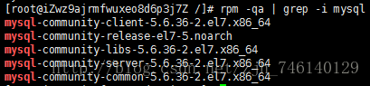
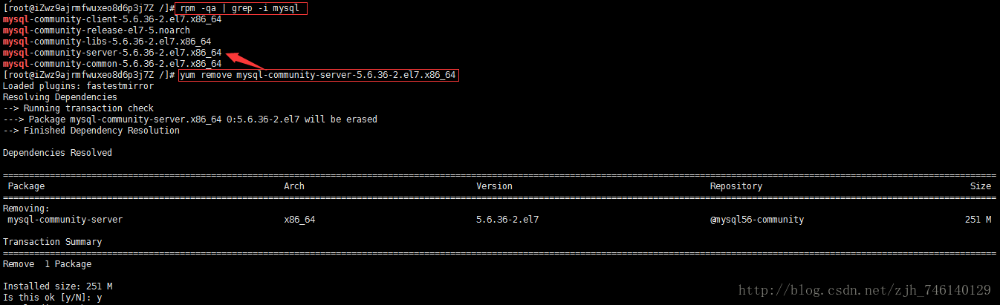
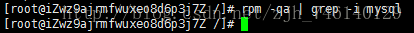
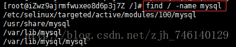
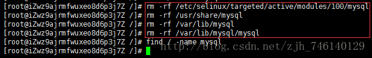

### Install
#### 1. get Src Yum  
MySQL5.7  
  
    rpm -Uvh http://dev.mysql.com/get/mysql-community-release-el7-5.noarch.rpm
MySQL8.0.11

    rpm -Uvh http://dev.mysql.com/get/mysql57-community-release-el7-9.noarch.rpm  
Do

    [root@colinECS /]# rpm -Uvh http://dev.mysql.com/get/mysql57-community-release-el7-9.noarch.rpm
    Retrieving http://dev.mysql.com/get/mysql57-community-release-el7-9.noarch.rpm
    warning: /var/tmp/rpm-tmp.vJmA0S: Header V3 DSA/SHA1 Signature, key ID 5072e1f5:
    Preparing...                          ################################# [100%]
    Updating / installing...
       1:mysql57-community-release-el7-9  ################################# [100%]

#### 2. get list by yum

    [root@colinECS /]# yum repolist enabled|grep "mysql.*-community.*"

    mysql-connectors-community/x86_64 MySQL Connectors Community                  51
    mysql-tools-community/x86_64      MySQL Tools Community                       63
    mysql57-community/x86_64          MySQL 5.7 Community Server                 267

#### 3. install 
    [root@colinECS /]# yum -y install mysql-community-server

    Loaded plugins: fastestmirror
    Loading mirror speeds from cached hostfile
    Resolving Dependencies
    --> Running transaction check
    ---> Package mysql-community-server.x86_64 0:5.7.22-1.el7 will be installed
    --> Processing Dependency: mysql-community-common(x86-64) = 5.7.22-1.el7 for package: mysql-community-server-el7.x86_64
    --> Processing Dependency: mysql-community-client(x86-64) >= 5.7.9 for package: mysql-community-server-5.7.226_64
    --> Processing Dependency: libaio.so.1(LIBAIO_0.4)(64bit) for package: mysql-community-server-5.7.22-1.el7.x8
    --> Processing Dependency: libaio.so.1(LIBAIO_0.1)(64bit) for package: mysql-community-server-5.7.22-1.el7.x8
    --> Processing Dependency: libaio.so.1()(64bit) for package: mysql-community-server-5.7.22-1.el7.x86_64
    --> Running transaction check
    ---> Package libaio.x86_64 0:0.3.109-13.el7 will be installed
    ---> Package mysql-community-client.x86_64 0:5.7.22-1.el7 will be installed
    --> Processing Dependency: mysql-community-libs(x86-64) >= 5.7.9 for package: mysql-community-client-5.7.22-164
    ---> Package mysql-community-common.x86_64 0:5.7.22-1.el7 will be installed
    --> Running transaction check
    ---> Package mariadb-libs.x86_64 1:5.5.56-2.el7 will be obsoleted
    --> Processing Dependency: libmysqlclient.so.18()(64bit) for package: 2:postfix-2.10.1-6.el7.x86_64
    --> Processing Dependency: libmysqlclient.so.18(libmysqlclient_18)(64bit) for package: 2:postfix-2.10.1-6.el7
    ---> Package mysql-community-libs.x86_64 0:5.7.22-1.el7 will be obsoleting
    --> Running transaction check
    ---> Package mysql-community-libs-compat.x86_64 0:5.7.22-1.el7 will be obsoleting
    --> Finished Dependency Resolution
    
    Dependencies Resolved
    
    =============================================================================================================
     Package                               Arch             Version                     Repository
    =============================================================================================================
    Installing:
     mysql-community-libs                  x86_64           5.7.22-1.el7                mysql57-community
         replacing  mariadb-libs.x86_64 1:5.5.56-2.el7
     mysql-community-libs-compat           x86_64           5.7.22-1.el7                mysql57-community
         replacing  mariadb-libs.x86_64 1:5.5.56-2.el7
     mysql-community-server                x86_64           5.7.22-1.el7                mysql57-community
    Installing for dependencies:
     libaio                                x86_64           0.3.109-13.el7              base
     mysql-community-client                x86_64           5.7.22-1.el7                mysql57-community
     mysql-community-common                x86_64           5.7.22-1.el7                mysql57-community
    
    Transaction Summary
    =============================================================================================================
    Install  3 Packages (+3 Dependent packages)
    
    Total download size: 193 M
    Downloading packages:
    (1/6): libaio-0.3.109-13.el7.x86_64.rpm                                                        |  24 kB  00:0
    warning: /var/cache/yum/x86_64/7/mysql57-community/packages/mysql-community-common-5.7.22-1.el7.x86_64.rpm: HDSA/SHA1 Signature, key ID 5072e1f5: NOKEY
    Public key for mysql-community-common-5.7.22-1.el7.x86_64.rpm is not installed
    (2/6): mysql-community-common-5.7.22-1.el7.x86_64.rpm                                          | 274 kB  00:0
    (3/6): mysql-community-libs-5.7.22-1.el7.x86_64.rpm                                            | 2.1 MB  00:0
    (4/6): mysql-community-libs-compat-5.7.22-1.el7.x86_64.rpm                                     | 2.0 MB  00:0
    (5/6): mysql-community-client-5.7.22-1.el7.x86_64.rpm                                          |  24 MB  00:0
    (6/6): mysql-community-server-5.7.22-1.el7.x86_64.rpm                                          | 165 MB  00:0
    -------------------------------------------------------------------------------------------------------------
    Total                                                                                 1.1 MB/s | 193 MB  00:0
    Retrieving key from file:///etc/pki/rpm-gpg/RPM-GPG-KEY-mysql
    Importing GPG key 0x5072E1F5:
     Userid     : "MySQL Release Engineering <mysql-build@oss.oracle.com>"
     Fingerprint: a4a9 4068 76fc bd3c 4567 70c8 8c71 8d3b 5072 e1f5
     Package    : mysql57-community-release-el7-9.noarch (installed)
     From       : /etc/pki/rpm-gpg/RPM-GPG-KEY-mysql
    Running transaction check
    Running transaction test
    Transaction test succeeded
    Running transaction
    Warning: RPMDB altered outside of yum.
      Installing : mysql-community-common-5.7.22-1.el7.x86_64
      Installing : mysql-community-libs-5.7.22-1.el7.x86_64
      Installing : mysql-community-client-5.7.22-1.el7.x86_64
      Installing : libaio-0.3.109-13.el7.x86_64
      Installing : mysql-community-server-5.7.22-1.el7.x86_64
      Installing : mysql-community-libs-compat-5.7.22-1.el7.x86_64
      Erasing    : 1:mariadb-libs-5.5.56-2.el7.x86_64
      Verifying  : mysql-community-libs-compat-5.7.22-1.el7.x86_64
      Verifying  : mysql-community-common-5.7.22-1.el7.x86_64
      Verifying  : mysql-community-server-5.7.22-1.el7.x86_64
      Verifying  : mysql-community-client-5.7.22-1.el7.x86_64
      Verifying  : mysql-community-libs-5.7.22-1.el7.x86_64
      Verifying  : libaio-0.3.109-13.el7.x86_64
      Verifying  : 1:mariadb-libs-5.5.56-2.el7.x86_64
    
    Installed:
      mysql-community-libs.x86_64 0:5.7.22-1.el7              mysql-community-libs-compat.x86_64 0:5.7.22-1.el7
      mysql-community-server.x86_64 0:5.7.22-1.el7
    
    Dependency Installed:
      libaio.x86_64 0:0.3.109-13.el7                            mysql-community-client.x86_64 0:5.7.22-1.el7
      mysql-community-common.x86_64 0:5.7.22-1.el7
    
    Replaced:
      mariadb-libs.x86_64 1:5.5.56-2.el7
    
    Complete!

#### 4. Join machine start
 
    [root@colinECS /]# systemctl enable mysqld
check is that do success[Optional/可选]  
0:关闭 1:关闭 2:启用 3:启用 4:启用 5:启用 6:关闭停止：

    [root@colinECS /]# chkconfig --list | grep mysql* mysqld

#### 5. Start SQL Service 

    [root@colinECS /]# systemctl start mysqld

#### 6. Get Status
    
    [root@colinECS /]# systemctl status mysqld
    
    ● mysqld.service - MySQL Server
       Loaded: loaded (/usr/lib/systemd/system/mysqld.service; enabled; vendor preset: disabled)
       Active: active (running) since Sat 2018-06-02 12:05:09 CST; 15s ago
         Docs: man:mysqld(8)
               http://dev.mysql.com/doc/refman/en/using-systemd.html
      Process: 1324 ExecStart=/usr/sbin/mysqld --daemonize --pid-file=/var/run/mysqld/mysqld.pid $MYSQLD_OPTS (co, status=0/SUCCESS)
      Process: 1251 ExecStartPre=/usr/bin/mysqld_pre_systemd (code=exited, status=0/SUCCESS)
     Main PID: 1328 (mysqld)
       CGroup: /system.slice/mysqld.service
               └─1328 /usr/sbin/mysqld --daemonize --pid-file=/var/run/mysqld/mysqld.pid
    
    Jun 02 12:05:01 colinECS systemd[1]: Starting MySQL Server...
    Jun 02 12:05:09 colinECS systemd[1]: Started MySQL Server.

#### 7. Get Temporary password
    
    [root@colinECS /]# grep 'temporary password' /var/log/mysqld.log
    2018-06-02T04:05:04.721743Z 1 [Note] A temporary password is generated for root@localhost: l7fnpYY#owEA
    
    [root@colinECS /]# mysql -uroot -pl7fnpYY#owEA
    mysql: [Warning] Using a password on the command line interface can be insecure.
    Welcome to the MySQL monitor.  Commands end with ; or \g.
    Your MySQL connection id is 4
    Server version: 5.7.22
    
    Copyright (c) 2000, 2018, Oracle and/or its affiliates. All rights reserved.
    
    Oracle is a registered trademark of Oracle Corporation and/or its
    affiliates. Other names may be trademarks of their respective
    owners.
    
    Type 'help;' or '\h' for help. Type '\c' to clear the current input statement.
    
    mysql>

#### 8. Password Change
##### 1. did
Must Contain number,small and big letter and char like'123Zz.'

    mysql> SET PASSWORD=PASSWORD('123Zz.');
    Query OK, 0 rows affected, 1 warning (0.00 sec)
Then change pwd rules that can use simple pwd
    
    mysql> set global validate_password_policy=0;
    Query OK, 0 rows affected (0.00 sec)
    
    mysql> set global validate_password_length=1;
    Query OK, 0 rows affected (0.00 sec)
And Change back to simple pwd

##### 2. others did
    mysql> ALTER USER 'root'@'localhost' IDENTIFIED BY 'MyNewPass4!';

##### 3. tips may need latter
如果忘记了MySQL root密码，可以用以下方法重新设置：
1.KILL掉系统里的MySQL进程

    killall -TERM MySQLd 
2.用以下命令启动MySQL，以不检查权限的方式启动；

    safe_MySQLd --skip-grant-tables & 

3.然后用空密码方式使用root用户登录 MySQL；

    MySQL -u root 

4.修改root用户的密码；

    MySQL> update MySQL.user set password=PASSWORD('新密码') where User='root';  
    MySQL> flush privileges;  
    MySQL> quit 

重新启动MySQL，就可以使用新密码登录了。

    

#### 9. Make navicat can login [For error 1130]  
1130 -  Host 'gitmmp.com' is not allowed to connect to this MySQL server
    
    mysql>use mysql;
    mysql>select 'host' from user where user='root';
    mysql>update user set host = '%' where user ='root';
    mysql>flush privileges;

### Remove

1.查看已安装的mysql
命令：rpm -qa | grep -i mysql



2.卸载mysql
命令：yum remove mysql-community-server-5.6.36-2.el7.x86_64



查看mysql的其它依赖：rpm -qa | grep -i mysql
使用yum remove mysql-xxx依次卸载，知道mysql的其它依赖全部卸载掉为止



3.删除mysql文件目录
使用命令查看mysql相关的文件目录：find / -name mysql



使用rm -rf 命令删除mysql的文件目录



至此mysql已成功卸载